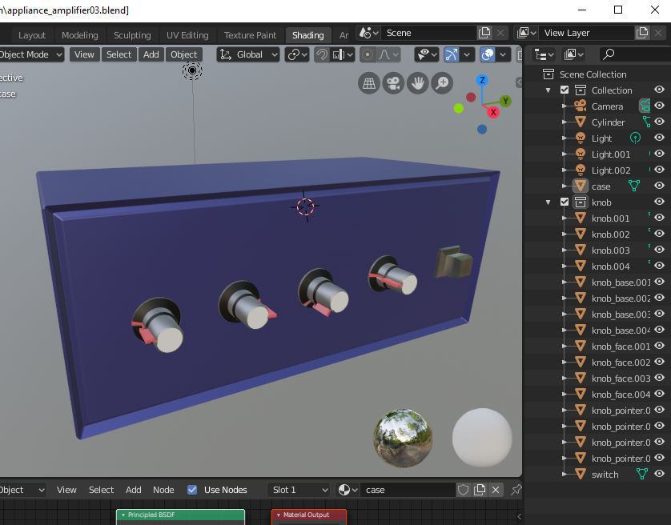

## Blender Python Notes

Quickstart when running in blender
- start Blender
- go to Scripting tab
- key module is bpy. ( press control + space for autocomplete to see functions)

When doing normal modelling, tab to the Scripting tab to see the python commands it generates (though, they are usually chock full of parameters, mostly defaults but at least you can see when the module is called to do the task)

### Object Stats

Run the script to get object stats by
- opening your /blend file normally
- go to the scripting tab, then New and paste in the sript
- run the script and a CSV file will be saved with your object data specs

The "Appliance_amplifier" example CSV is based on the blend file below

